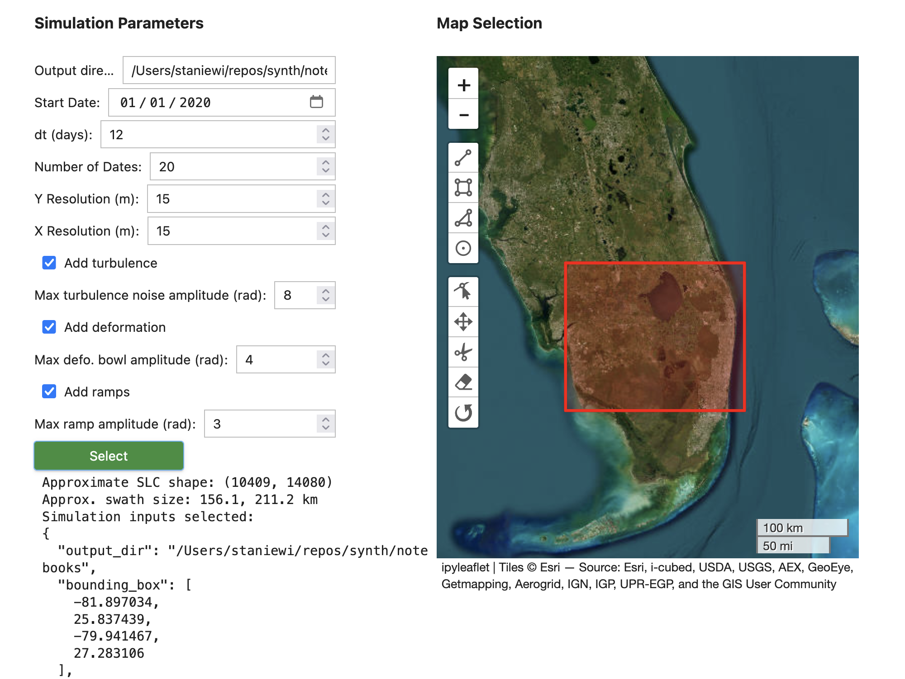
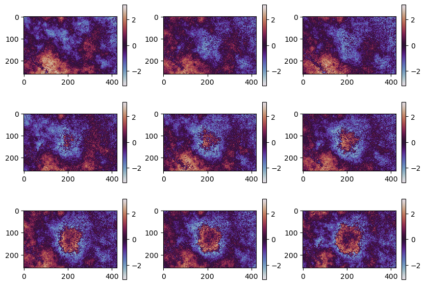
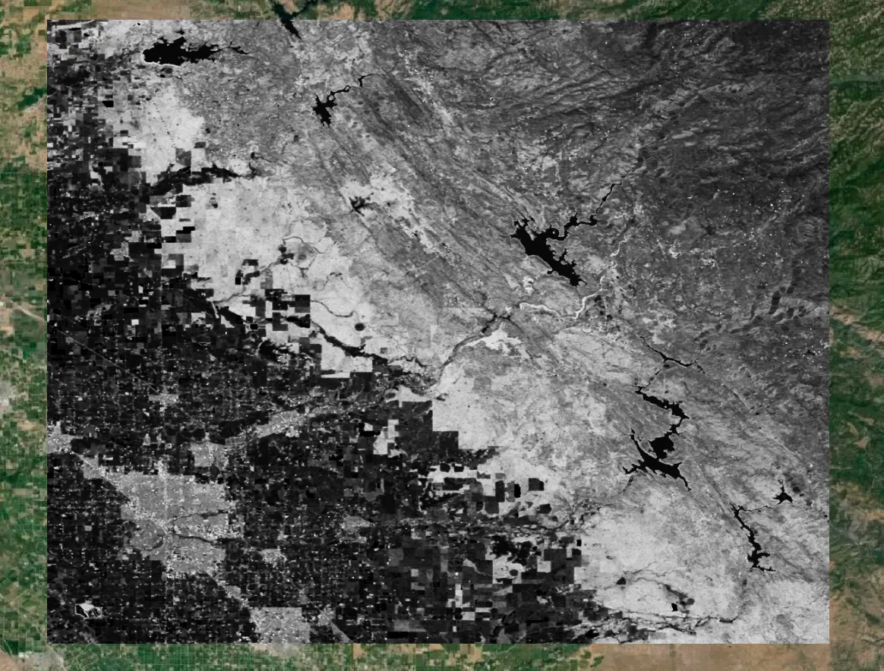
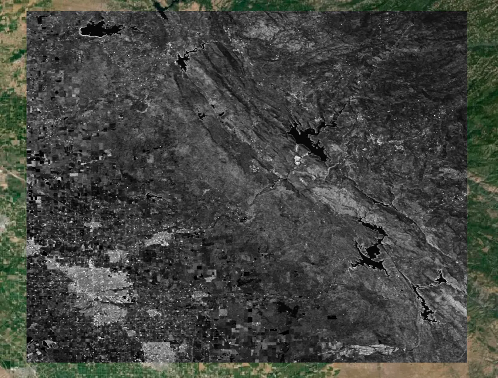

# synth

[![Actions Status][actions-badge]][actions-link]
[![PyPI version][pypi-version]][pypi-link]
[![Documentation Status][rtd-badge]][rtd-link]

[![Conda-Forge][conda-badge]][conda-link]
[![GitHub Discussion][github-discussions-badge]][github-discussions-link]

<!-- prettier-ignore-start -->
[actions-badge]:            https://github.com/isce-framework/synth/workflows/CI/badge.svg
[actions-link]:             https://github.com/isce-framework/synth/actions
[conda-badge]:              https://img.shields.io/conda/vn/conda-forge/synth
[conda-link]:               https://github.com/conda-forge/synth-feedstock
[github-discussions-badge]: https://img.shields.io/static/v1?label=Discussions&message=Ask&color=blue&logo=github
[github-discussions-link]:  https://github.com/isce-framework/synth/discussions
[pypi-link]:                https://pypi.org/project/synth/
[pypi-platforms]:           https://img.shields.io/pypi/pyversions/synth
[pypi-version]:             https://img.shields.io/pypi/v/synth
[rtd-badge]:                https://readthedocs.org/projects/synth/badge/?version=latest
[rtd-link]:                 https://synth.readthedocs.io/en/latest/?badge=latest

<!-- prettier-ignore-end -->

`synth` is a package to generate synthetic stacks of single-look complex (SLC) SAR data for InSAR time series analysis.
Realistic results are achieved by using the [global seasonal coherence dataset](https://www.nature.com/articles/s41597-022-01189-6) to create realistic decorrelation, and by using the `troposim` package to generate tropospheric turbulence noise.

The overall workflow [for generating a stack of SLCs](src/synth/core.py) is as follows:
- Choose an area of interest (AOI) and set the [parameters for the noise sources](src/synth/config.py#SimulationInputs)
- Generate the "truth phase"/"propagation phase" sources, which may include deformation, tropospheric turbulence, and phase ramps
- Download the coherence and backscatter data to use for correlation models
- For each pixel, create a coherence matrix using the decorrelation model and the truth phase differences
- Generate correlated noise samples for this pixel and multiply by the average backscatter

The SLCs are saved in GeoTIFF format, one raster per requested date.
The propagation phases are also saved as 3D data cubes in HDF5 files.

Note that the "truth" phase sources included tropospheric noise and phase ramps; since one common use is to compare the ability of [phase linking algorithms](https://github.com/isce-framework/dolphin) to estimate a wrapped phase time series, the desired outputs include all "propagation phases".

## Propagation phase sources

### Tropospheric Turbulence

The tropospheric turbulence noise uses the [`troposim`](https://github.com/scottstanie/troposim) package (Staniewicz, 2024), which uses an isotropic representation of the power spectral density (PSD) (cite: Hanssen, 2001).

### Phase ramp

To simulate longer-wavelength noise sources, we allow simple planar phase ramps to be added at each date.
The maximum amplitude may be set, and the orientation of each date's phase ramp is randomized

### Deformation sources

Currently, the following deformation sources are supported:
- Gaussian blob
- (to move from `troposim`): Okada model
- (to move from `troposim`): Geertsma reservoir source model

## Decorrelation Noise

At each pixel, we use some decorrelation model to create a coherence matrix $T$ to model the temporal correlation of the noise.
A coherence matrix is power-normalized, meaning that the relation to a covariance matrix covariance matrices $C$, which is related to $T$ by

$$
C = T \circ \boldsymbol{\sigma}\boldsymbol{\sigma}^{H}
$$

where $\circ$ is the Hadamard product, and $\boldsymbol{\sigma}= [\sigma_{1}, \dots, \sigma_{N}]^{T}$ is the vector of SLC standard deviations: $\sigma_{k} = \sqrt{ \mathbf{E}[\mid x_{k}\mid^{2} ] }$  .
Once we find $L$ such that $L L^{H} = T$, we multiply an instance $\mathbf{y}$ of Circular Complex Gaussian (CCG) noise to obtain $\mathbf{z} = L \mathbf{y}$, our correlated noise sample. If we want the amplitudes to match real data, we can multiply $A \mathbf{z}$, where $A = \text{diag}(\mathbf{\boldsymbol{\sigma} })$

To generate random samples which follow a given matrix $\Sigma$ ?

1. Generate a noise sample $\mathbf{x} \in \mathbb{R}^{N}$ drawn from the multivariate standard normal: $\mathbf{x} \sim \mathcal{N}(\mathbf{0}, I)$
2. Cholesky factor[^1] $\Sigma$ into $L L^{H}$
3. The vector $\mathbf{y} = L \mathbf{x}$ will be distributed $\sim \mathcal{N}(0, \Sigma)$

We see that covariance of $\mathbf{y}$ is

$$
\begin{gather}
\mathbf{E}[\mathbf{y} \mathbf{y}^{T} ] = \mathbf{E}[L\mathbf{x}(L\mathbf{x})^{H}] \\
= L \mathbf{E}[\mathbf{x}\mathbf{x}^{H}]L^{H} \\
= L I L^{H} \\
= \Sigma
\end{gather}
$$

[^1]: Actually, any factorization such that $\Sigma = L L^{T}$ would work. The `multivariate_normal` function has three options: Cholesky, eivenvalue decomposition with `eigh`, and SVD. The Cholesky is the fastest, but least robust if your covariance matrix is near-singular.

### Making the decorrelation realistic
Choosing random decorrelation parameters for each pixel in space would not be conducive for running real workflows that rely on averaging pixels in space.
Therefore, we use the global coherence dataset to estimate the decorrelation parameters for each pixel.

The coherence dataset, publicly available on [AWS](https://aws.amazon.com/marketplace/pp/prodview-iz6lnjbdlgcwa#overview), contains seasonal coherence models and average backscatter. The model for coherence $\gamma$ was

$$
\gamma(t) = (1 - \rho_{\infty})\exp(-t / \tau) + \rho_{\infty}
$$
where $\rho_{\infty}$ is the long-term coherence, $\tau$ is the decorrelation time, and $t$ is the time in days.
The backscatter model $\sigma_0$ was also estimated for each season.

### Using the decorrelation model parameters

Two example $\rho_{\infty}$ maps are shown below over the Central Valley in California. The first is for winter, and the second is for fall.

To create an exponentially decaying correlation matrix, we could attempt to blend all four seasons' model parameters; howeveer, for the current version, we have simply chosen the minimum $\rho_{\infty}$ to use for the entire pixel's stack.
For certain regions, even using the minimum $\rho$ did not produce very strong decorrelation noise. Therefore we also added an option to use, as the long-term coherence value

$$
\begin{cases}
\rho^2 & \text{if } \rho > 0.2 \\
\rho^4 & \text{otherwise}
\end{cases}
$$

This is a heuristic to shrink all long-term coherences toward zero, where the $\rho^{4}$ case is to add more noise in low-coherence regions to combat the upwardly biased coherence estimator[^2].

[^2]: While it's true that the Kellndorfer paper says the bias is very low due to the number of looks they took, my initial Central Valely test had very few regions that looks like pure noise even after 1 year.

### Modeling seasonal decorrelation

Since certain regions show large differences for $\rho_{\infty}$ we create a "seasonal" map for pixels which have a peak-to-peak change greater than some threshold (e.g. 0.5).
For pixels with $\max_{k}(\rho^{k}_{\infty}) - \min_{k}(\rho_{\infty}^{k})>0.5$, we model decorrelation similar to (cite Even and Schulz, 2018). The correlation $\gamma$ between for the interferogram formed using images from time $t_{m}$ and $t_{n}$ is

$$
\gamma(t_{m}, t_{n}) = \left( A + B\cos\left( \frac{2\pi t_{n}}{365} \right) \right) \left( A + B\cos\left( \frac{2\pi t_{m}}{365} \right) \right)
$$

where $A, B$ are related to $\rho_{\infty}$ and $\rho_{0}$ (the initial correlation) by $\gamma_{0} = (A + B)^{2}$ and $\gamma_{min} \triangleq \rho_{\infty} = (A - B)^{2}$.
We can solve for the $A, B$ parameters by inverting this relation: Since $\gamma_{0}=1$ in the (Kellndorfer, 2020) model, then $B = (1 - A)$, and thus

$$
\begin{gather}
A = \frac{1}{2} (1 + \sqrt{ \rho_{\infty} })  \\
B = \frac{1}{2} (1 - \sqrt{ \rho_{\infty} })
\end{gather}
$$

## Results

(todo)
